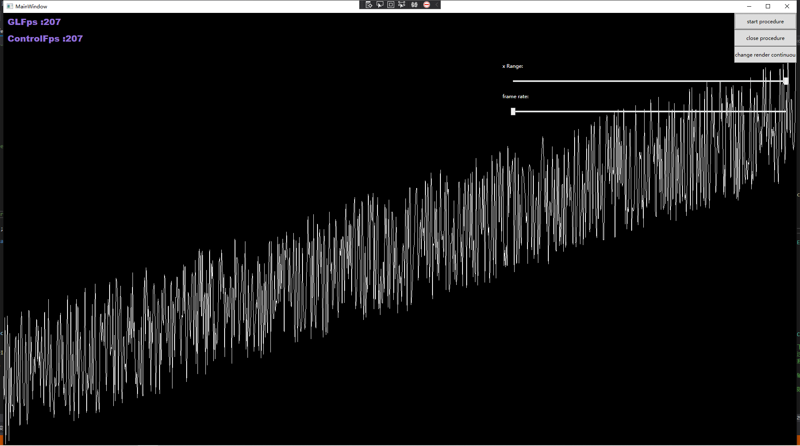

# Declaration
A fast, flexible and native opentk wpf control.

## Feature

0. Solved problem flickering in intel uhd gpu on low framerate when use offical [official library](https://github.com/opentk/GLWpfControl) (As offical library use d3dimage, It's very strange that intel uhd gpu will flicing on low framerate but my gtx970 will not. I'll discuss the phenomenon below.)

1. Render in standlone thread, no blocking in ui thread.

2. WPF native control.

3. Enable MSAA.

4. Use fence to maximize performance.

5. More functionality than official control: Can stop and resume render; preview render; auto suspend render when control is user invisible; frame rate limit; draw fps; several approaches to push render.

The following shows line chart with msas x2.

